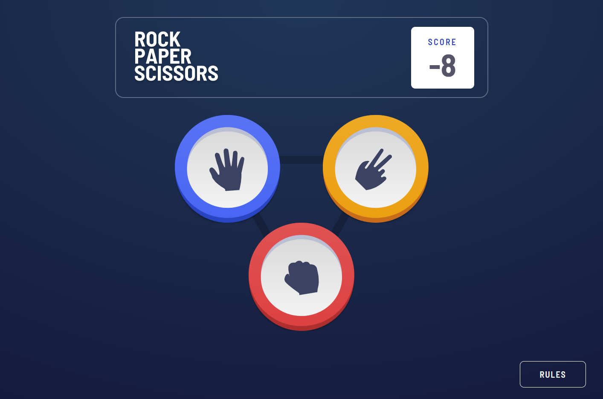

# Frontend Mentor - Rock, Paper, Scissors solution

This is a solution to the [Rock, Paper, Scissors challenge on Frontend Mentor](https://www.frontendmentor.io/challenges/rock-paper-scissors-game-pTgwgvgH). Frontend Mentor challenges help you improve your coding skills by building realistic projects. 

## Overview

### The challenge

Users should be able to:

- View the optimal layout for the game depending on their device's screen size
- Play Rock, Paper, Scissors against the computer
- Maintain the state of the score after refreshing the browser _(optional)_

### Screenshot

### Links

- [Frontend Mentor: Solution URL](https://www.frontendmentor.io/solutions/rock-paper-scissors-with-react-and-tailwind-_x7tC0t0v5)
- [Vercel: Live Site URL](https://rock-paper-scissors-ashen.vercel.app/)

## My process

### Built with

- Semantic HTML5 markup
- CSS custom properties
- Tailwind CSS
- [React](https://reactjs.org/) - JS library

## What I learned

I learned there's a lot about react hooks that I don't understand yet. Initially, I had a problem with accessing the updated `useState` variables because when you change the value using the set function, you don't have access to the updated value until react rerenders the page, so I decided to restructure my functions so it'll work.

I also realize that I don't understand the async/await syntax yet, and I decided to still use the Promise.then() chaining to update the computer variable after a timeout delay and declare the winner with the result.

Also, framer-motion is so cool.

## Continued development

I plan to learn more and practice more. Initally, I wanted to implement an online feature, but I think my code needs some refactoring for readability, and I need to start on smaller node.js projects before tackling a problem like real-time functionality. I did end up doing some research about HTTP polling and websockets, but I think I don't understand enough about Node and Express to use a library like socket-io. I will continue to improve before choosing more difficult projects.

I want to learn how to write better code, and the only way I'll do that is to keep writing more code.

---

## Author
Ian Wu

- Frontend Mentor - [@iannnop](https://www.frontendmentor.io/profile/iannnop)
- LinkedIn - [@iannnop](https://www.linkedin.com/in/iannnop/)
- Instagram - [@iannnop_frontend](https://www.instagram.com/iannnop_frontend/)
- Twitter - [@iannnop](https://www.twitter.com/iannnop)
